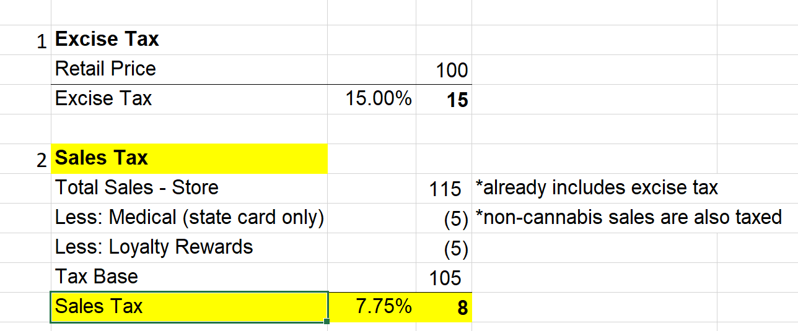

California dispensary sales tax is a complicated topic with many nuances, which requires attention to detail and specialized knowledge. Here is a brief overview of how these taxes work:

Steps to calculate California dispensary sales taxes:

               Step 1. The first step is to calculate your excise tax. The reason we need to calculate excise tax first is that sales tax is levied on excise tax, so if your excise tax calculation is wrong your sales tax calculation will also be incorrect. There are a couple of details that you need to know about excise tax which you can read about [**here.** ](https://redeyecpa.com/blog/how-to-calculate-california-cannabis-excise-tax/)Excise tax is 15% of your retail price, so if your product is $100 your excise tax is $15.

               Step 2. Calculate the dispensary sales tax. Sales tax rates vary depending on your location, but the average sales tax rate throughout California is around 7.25% - 7.50%. Since excise tax is also taxed, you will need to add it to your retail price.

Here is the formula:

***Please note***: Sales tax is not levied on marijuana sales to those with medical state cards. However, sales with a doctor’s letter of recommendation are taxed. So, whenever you are doing your sales tax computation make sure you exclude sales to those with medical state cards. You should also deduct customer discounts from your tax base as well.

Things get more complicated if you decide to do home delivery of the product. Since the tax rate is determined by the location of the customer, your sales tax rates will vary significantly. This means that your delivery system should be carefully updated for all sales tax rates in the area. If you use Weedmaps for delivery, you will have to manually adjust software tax settings for all locations in your geographical area. By default, Weedmaps does not generate information on taxes and many first-time customers become very upset when they realize that they have to pay an additional 30% -40% on top of the sales price.

Another difficulty with home delivery is that you are also required to levy tax on your delivery and safety fees if you charge those fees to your customer.

So, the tax formula for sale tax of a delivered product will be this: