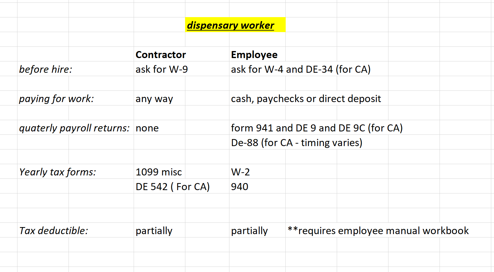

There are two ways you can pay your dispensary worker.
You can pay him/her as a **contractor.** Or you can pay him/her as an **employee**.

You cannot pick which option you like the best. **[IRS](https://www.irs.gov/businesses/small-businesses-self-employed/independent-contractor-defined)** and **[EDD](https://www.edd.ca.gov/pdf_pub_ctr/de38.pdf)** have special rules that determine the status of your worker. Their guidelines are nothing complicated, and you being a cannabis business does not affect the outcome. The major rule here is this: if you have general control over the actions of the worker, that person is your employee. If there is not much supervision from you, he is your contractor.
Paying your workers as contractors is always beneficial. This is mostly because you don’t spend money on paying their employee payroll taxes. The Contractor status also eliminates such problems, such as banking, payroll fees, employer contributions to 401k, health insurance, and so on. Having contractors is cheaper and profitable for the business. However, the contractor status is frowned upon and scrutinized by the government and state agencies. If the IRS and EDD determine that you’ve been wrongly treating your employees as contractors, they will impose big fines and penalties.
Please note, if you determine that your cannabis worker is indeed a contractor ( and not an employee) you must ask him/her for W-9. W-9 is the equivalent of W-4 for an employee. Form W-9 asks for the EIN/SS of your contractor and shields you from responsibility in case your contractor lies about their correct identification number. And yes, even though your worker is in the cannabis business, you still have issue 1099 as long as you paid him/her over $600.

The bad news is that majority of budtenders do not qualify as contractors. We should consider them employees. This means an additional cost to you. As an employer, you are required to withhold taxes on behalf of their employees, pay your part of employment taxes, file quarterly payroll returns, and so on. A smaller employer can pay in cash, but bigger employers are required to file and pay electronically. There are several cannabis-friendly payroll companies where you could outsource your payroll. Such companies as **[Wurk ](https://www.enjoywurk.com/)**and **[Gusto](https://gusto.com/)** will make your life much easier since all you have to do is to send them a bank transfer on a certain date.

But what if you don’t have banking? Your budtender is your employee and the only way you could pay him/her is cash? Well, there is nothing wrong with paying your employees in cash, as long as your tax withholdings and contributions are correct and you timely file your payroll tax returns. You can use any payroll software ( it does not have to be Cannabis-related) to generate correct pay stubs for your employees. And you can use the same software to e-file the IRS and EDD payroll tax returns. Both** [IRS ](https://www.irs.gov/payments/pay-with-cash-at-a-retail-partner)**and **[EDD](ps://edd.ca.gov/Payroll_Taxes/Cannabis_Industry_Payroll_Tax_Reporting.htm)** accept cash payments at participating locations. Paying your employees in cash is a hassle, but it is doable. But *please make sure to keep your receipts and make your employees sign your copy of the paystub.* That signed paystub copy will be your record of payment in the case of the tax audit.

If you continue to grow and open up a couple more dispensaries, it makes sense to establish a separate entity, which will be dealing specifically with payroll. This allows cheaper group health insurance, payroll service rates, and timely organization of payments across all entities. Please note, just establishing a separate entity won’t shield you from the IRS 280E rules, and the majority of your wages expense still won’t be deductible.

There is, however, a tiny loophole when it comes to tax deductions. According to[ **1. 471.3-b** ](https://www.law.cornell.edu/cfr/text/26/1.471-3)you can deduct necessary charges incurred in acquiring and possession of inventory. So, the cost of labor associated with selling your product is a non-deductible expense. However, the cost of labor associated with handling inventory and preparing it for sale is deductible. This rule applies to both contractor and employee status.

How do you determine the deductible portion of the labor? Well, you could create a special employee position, and make the hired person deal with inventory only. This person would not sell and advertise the product. He would only pack, weight, transport, and guard your inventory. But what if you cannot afford to hire an extra worker? In this case, you could allocate the time of your current employees.

The easiest way to document the deductible cost is to outline it in your employee manual. When writing about employees’ responsibilities, indicate the percentage of time that budtenders dedicate to inventory handling. At the end of the year, your tax accountant will multiply the percentage by total wage and will deduct the allowed expense. The rest of the expense will be disallowed. You could also experiment with clock cards and make your employees clock their time associated with inventory handling. The key here is *record keeping*. Tax deductions will be disallowed if you cannot provide documentation to support your deduction.

As you can see, payroll for cannabis dispensaries is difficult but doable. Having banking makes the whole process much easier since there is a way to outsource it. However, cash payments can be arranged too.

Please let me know if you have any questions and we will be able to assist you. At Red Eye CPA we provide payroll support for cash-only cannabis dispensaries.

Sincerely,
Daria