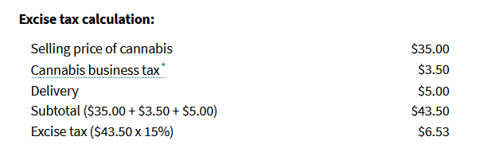
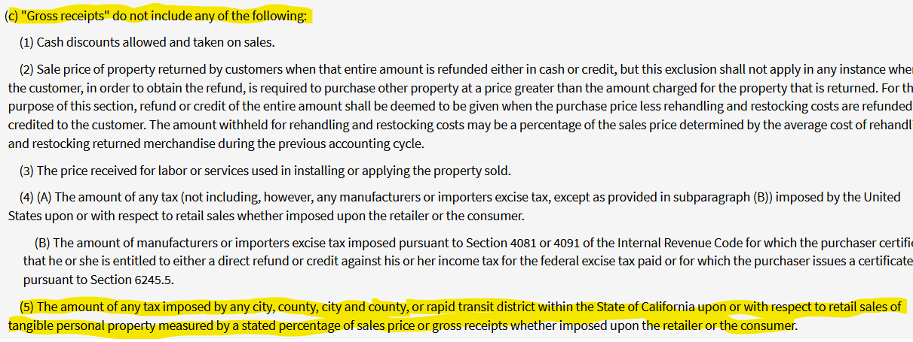

California Excise tax is a pass-through tax - it is not paid by the cannabis business. The distributor charges this tax to the dispensary and remits it to the CDTFA. In its turn, the dispensary gets the money back by charging its customers at the moment of sale.

When calculating the California Cannabis Excise tax, we first need to determine the type of transaction that is taking place. Distributors are the ones that remit Cannabis Excise tax, and they conduct two types of transactions: [Non-Arm’s-length and Arm’s length.](https://www.cdtfa.ca.gov/industry/cannabis.htm#Distributors)

**\*\*Arm’s length means that the distributor and the retailer are unrelated parties.** The distributor and the retailer do not have common owners and are not part of the same business structure. With unrelated parties, the calculation of Excise tax is relatively simple. We simply take the cost of good sold and multiply it by the CDTFA mark up rate, currently 80%. After that we tax everything by 15%:

After simplifying the equation, we can see that we will arrive at the correct Excise tax  by multiplying COGS by 24%.

Calculating Excise tax as unrelated parties is more beneficial. In my experience, the markup rate for dispensaries is usually 100% and not 80%. This means that you are not taxing 20% of your sales.

**\*\*Non-Arm’s-length** **means that the distributor and the retailer are related** **parties**. In this type of transaction, the taxable base is your end retail price to the consumer. The CDTFA website gives a detailed explanation, and here is a screenshot of their example:

As you can see in the above picture, the Excise tax is also levied at the City tax. I believe that the CDTFA website is wrong since the [Revenue and Taxation Code Section 6102](https://www.cdtfa.ca.gov/lawguides/vol1/sutl/6012.html) explicitly states that City tax should not be taxed.

In my opinion, the Excise tax formula for related parties is the following:

**(retail price +delivery+safety fees-promotions) * 15%**

**Please note that Excise tax is levied only on Cannabis. If you also sell vapors, gadgets**, **or clothing at your store, this merchandise should not be subject to Excise tax. This means that you need to run a sale report from your Point Of Sale system that** only shows **Cannabis** sales**.** 

Those are the major points about California Cannabis Excise tax. If you need help setting up your Point of Sale System, please contact me at [daria@redeyecpa.com](mailto:daria@redeyecpa.com).

Sincerely, 

Daria Nagal, Cannabis CPA